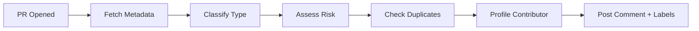

# 🤖 OpenClaw PR Triage Action

> **Automated PR triage for large repositories** — classifies, assesses risk, detects duplicates, profiles contributors, and posts structured triage summaries on every PR.

Built for [OpenClaw](https://github.com/openclaw/openclaw) to handle the 3,600+ PR/issue backlog — but works on any GitHub repo.

---

## What It Does

When a PR is opened, this Action automatically:

| Step | What Happens |
|------|-------------|
| **1. Classify** | Detects PR type (bug-fix, feature, refactor, docs, deps, ci, test) from title, description, branch name, and changed files |
| **2. Risk Assessment** | Rates risk (low → critical) based on security-sensitive files, CI changes, and change size |
| **3. Duplicate Check** | Compares against open PRs for file overlap — flags potential plagiarism with different authors |
| **4. Contributor Profile** | Identifies first-time contributors, calculates merge rate, assigns a trust tier |
| **5. Auto-Label** | Applies classification labels (`triage:bug-fix`, `risk:high`, `security`, `size:large`) |
| **6. Post Comment** | Posts a structured triage summary as a PR comment (updates on re-push) |

## Example Output

When someone opens a PR, the bot posts this comment:

```
## 🚨 PR Triage — #15518

🚨 **Security Review Required** — This PR touches security-sensitive code.
   Request a security-focused reviewer.

---

### 📊 Classification

| Field        | Value                              |
|-------------|-------------------------------------|
| **Type**    | 🐛 `bug-fix`                        |
| **Risk**    | 🔴 `critical`                       |
| **Size**    | `+847 / -312` across 23 files       |
| **Branch**  | `fix/session-recovery` → `main`     |
| **Mergeable** | CLEAN                             |

**Risk factors:**
- Touches security-sensitive files
- Large change: 1159 lines across 23 files

**Suggested labels:** `triage:bug-fix` `risk:critical` `security` `size:large`

### 👤 Contributor: @TsekaLuk

| Metric       | Value        |
|-------------|--------------|
| **Tier**    | ⭐ Trusted    |
| **Merged**  | 21 ✅         |
| **Merge Rate** | 87%       |

> Fast-track review recommended — high merge rate.
```

## Quick Start

Add this file to your repo at `.github/workflows/pr-triage.yml`:

```yaml
name: PR Triage

on:
  pull_request:
    types: [opened, reopened, synchronize]

permissions:
  pull-requests: write
  issues: write
  contents: read

jobs:
  triage:
    runs-on: ubuntu-latest
    steps:
      - name: Triage PR
        uses: dinakars777/openclaw-triage-action@main
        with:
          github-token: ${{ secrets.GITHUB_TOKEN }}
```

That's it. Every new PR gets auto-triaged.

## Configuration

| Input | Default | Description |
|-------|---------|-------------|
| `github-token` | `GITHUB_TOKEN` | Token for API access |
| `enable-labels` | `true` | Auto-apply classification labels |
| `enable-duplicate-check` | `true` | Scan for duplicate/plagiarized PRs |
| `enable-contributor-profile` | `true` | Show contributor history and tier |
| `duplicate-threshold` | `50` | Minimum file overlap % to flag |

## Architecture

```
openclaw-triage-action/
├── action.yml                          # Action metadata and inputs
├── scripts/
│   └── triage-action.sh                # Core triage engine
├── .github/workflows/
│   └── pr-triage.yml                   # Example workflow
└── README.md
```

### How It Works



1. **Trigger**: GitHub fires `pull_request` event on open/reopen/push
2. **Fetch**: Uses `gh` CLI to pull PR metadata, files, author info
3. **Classify**: Pattern-matches title, body, branch, and file paths against type rules
4. **Risk**: Checks for security-sensitive paths, CI modifications, large diffs
5. **Duplicates**: Compares file lists against other open PRs, flags high overlap
6. **Contributor**: Queries author's merged/closed/open PR history, assigns trust tier
7. **Output**: Posts structured comment (or updates existing one), applies labels

## Why This Matters for OpenClaw

| Problem | Solution |
|---------|----------|
| 3,600+ open PRs with no classification | Auto-classify on open |
| Security PRs buried in the queue | Auto-flag and prioritize |
| Duplicate/stolen PRs | Detect via file overlap |
| First-time contributors get slow reviews | Surface them with guidance |
| Maintainers manually label everything | Auto-label by type and risk |

## Built By

**Dinakar** — OpenClaw contributor ([PR #6590](https://github.com/openclaw/openclaw/pull/6590))

---

*This Action is a prototype / proof-of-concept. It uses the `gh` CLI for all GitHub API interactions and runs entirely in bash — no external dependencies.*
